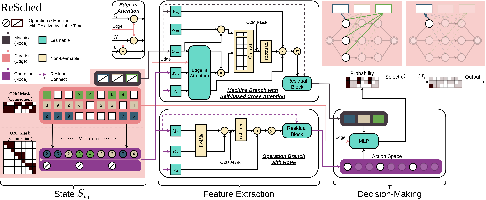

# ReSched: Rethinking Flexible Job Shop Scheduling from a Transformer-based Architecture with Simplified States

This repository is the official implementation of the paper 
[**ReSched: Rethinking Flexible Job Shop Scheduling from a Transformer-based Architecture with Simplified States**](https://openreview.net/forum?id=s5pWbwf2tk).



We would be glad if you cite our paper when using this work : )
```bibtex
@inproceedings{
  xiaoresched,
  title={RESCHED: Rethinking Flexible Job Shop Scheduling from a Transformer-based Architecture with Simplified States},
  author={Xiao, Xiangjie and Cao, Zhiguang and Zhang, Cong and Song, Wen},
  booktitle={The Fourteenth International Conference on Learning Representations},
  year={2026}
  url={https://openreview.net/forum?id=s5pWbwf2tk}
}
```

## Quick Start

### 1. Choose an Algorithm

Run the code inside the corresponding algorithm directory:

```bash
cd REINFORCE
python SchedulingMain.py
```

or:

```bash
cd PPO
python SchedulingMain.py
```

### 2. Choose a Problem Type

Modify the following line in `SchedulingMain.py`:

```python
PROBLEM = 'fjsp'   # 'fjsp', 'jssp', 'ffsp'
```

The program will then automatically load the matching configuration file from `configs/`.

### 3. Test an Existing Model

To evaluate a pretrained model, check the corresponding `configs/*.py` file:

```python
runner_params = {
    'test_only': True,
    'checkpoint': None,
    'model_path': '...'
}
```

Where:

- `test_only=True` means training is skipped and the model is evaluated directly
- `model_path` points to the `.pth` file to load
- `checkpoint` can be used to resume from an existing experiment directory

### 4. Train a New Model

To train a model, update the configuration as follows:

```python
runner_params = {
    'test_only': False,
    'checkpoint': None,
    'model_path': None
}
```

## Overview

This repository contains reinforcement learning based code for solving scheduling problems. 
It currently includes two training strategies:

- `PPO`
- `REINFORCE`

Both implementations share the same problem formulation and overall execution pipeline. The main difference is the training algorithm. The project currently supports the following scheduling problems:

- `JSSP`: Job Shop Scheduling Problem
- `FJSP`: Flexible Job Shop Scheduling Problem
- `FFSP`: Flexible Flow Shop Scheduling Problem

### 1. Project Structure

```text
ReSched-github/
├─ PPO/                        # PPO-based implementation
├─ REINFORCE/                  # REINFORCE-based implementation
├─ data/                       # Datasets and Open benchmarks
│  ├─ JSSP/
│  ├─ FJSP/
│  └─ FFSP/
├─ ckpt/                       # Pretrained weights and old model files
├─ result/                     # Experimental output results, logs, and source code snapshots
└─ README.md
```

### 2. Core Code Organization

The internal structure of `PPO/` and `REINFORCE/` is almost identical and can be understood through the following modules:

- `SchedulingMain.py`
  Entry point of the project. It selects the target problem type, such as `fjsp`, `jssp`, or `ffsp`.
- `configs/`
  Configuration files for environment settings, model settings, training settings, test settings, logging settings, and dataset loading logic.
- `SchedulingRunner.py`
  Main pipeline controller. It initializes the environment, model, trainer, and datasets, and manages training, validation, testing, and checkpoint handling.
- `SchedulingEnvironment.py`
  Scheduling environment implementation. It defines state representation, action execution, reward calculation, and makespan updates.
- `SchedulingModel.py`
  Policy network for scheduling decisions. It maps the current state to action probabilities. In PPO, it also includes a value estimation branch.
- `Trainer`
  Reinforcement learning training module. PPO uses `PPOTrainer.py`, while REINFORCE uses `REINFORCETrainer.py`.
- `SchedulingEvaluator.py`
  Evaluation and inference module for validation and test datasets.
- `SchedulingGenerator.py` / `SD1FJSPGenerator.py`
  Random instance generation and problem-specific data construction modules.
- `cp_sat.py`
  OR-Tools CP-SAT solver used as a baseline for comparison with reinforcement learning methods.
- `utils.py`
  Shared utilities for logging, random seed control, dataset loading, baseline loading, and checkpoint management.


### 3. Dataset Layout

The `data/` directory is organized by problem type:

- `data/JSSP/L2D/`
  JSSP datasets and benchmark instances.
- `data/FJSP/TNNLS/`
  FJSP datasets, benchmark instances, validation data, and OR baseline solutions.
- `data/FFSP/Matnet/`
  FFSP dataset files.

Each configuration file loads the corresponding dataset paths automatically.

### 4. Pretrained Checkpoints and Results

- `ckpt/`
  Stores pretrained model weights.
- `result/`
  Stores experiment outputs, usually including log files and source snapshots by using `'save_file': True`.

During training, logs and model files are automatically saved under timestamped directories in `result/`.


## Dependencies

The codebase mainly depends on `PyTorch` and a small set of scientific computing packages(`numpy`, `pandas`).

Or-tools is a non-essential component, only used for baseline calculations; results for most datasets and benchmarks are already provided.


- `torch == 2.3.1 (CUDA 12.1)`
- `ortools == 9.11.4210`
- `numpy`
- `pandas`

## References

The implementation of this work refers to the following excellent work:
- https://github.com/yd-kwon/POMO
- https://github.com/zcaicaros/L2D
- https://github.com/songwenas12/fjsp-drl/
- https://github.com/wrqccc/FJSP-DRL
- https://github.com/yd-kwon/MatNet
